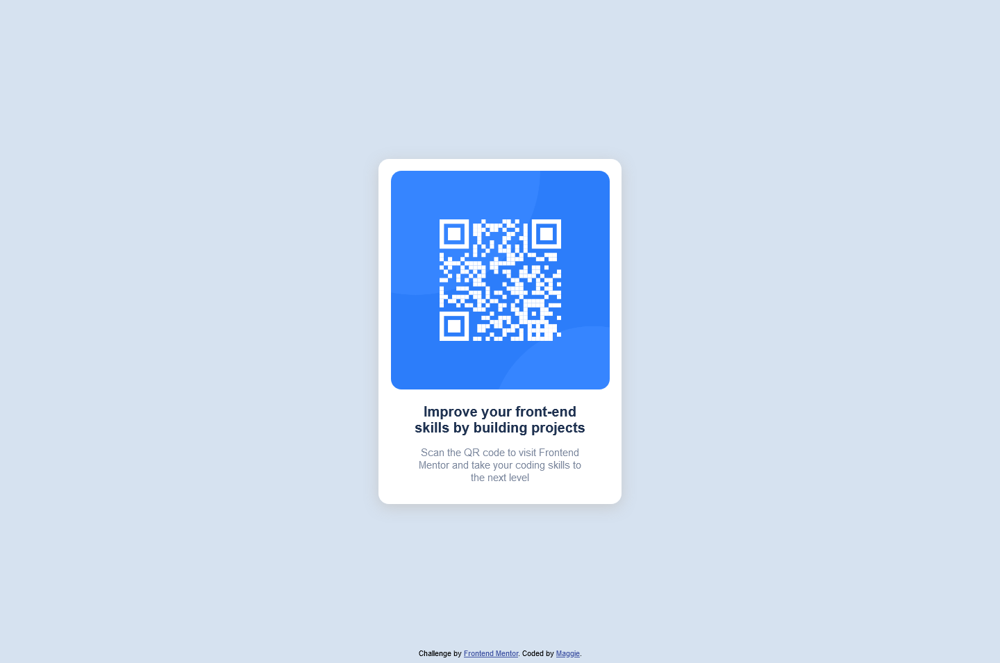

# Frontend Mentor - QR code component solution

This is a solution to the [QR code component challenge on Frontend Mentor](https://www.frontendmentor.io/challenges/qr-code-component-iux_sIO_H). Frontend Mentor challenges help you improve your coding skills by building realistic projects. 

## Table of contents

- [Overview](#overview)
  - [Screenshot](#screenshot)
  - [Links](#links)
- [My process](#my-process)
  - [Built with](#built-with)
  - [What I learned](#what-i-learned)
  - [Continued development](#continued-velopment)
- [Author](#author)
- [Acknowledgments](#acknowledgments)


## Overview

### Screenshot




### Links

- Solution URL: I wonder how may I generate the solution url before I even submit the solution??? So I will just include the live site at this time.
- Live Site URL: [Live Site on GitHub](https://ma1021.github.io/02_qr-code-component-main/)

## My process

2 difficulties I have overcome:

1. Weird space under img inside div

When img in the div, there is an invisible space below the img, it turns out that img was treated the same with text. Hence, there are [desender](https://en.wikipedia.org/wiki/Descender) underneath.

This could be solved by 
(1) Changing display of img
(2) Update vertical-align of img to middle

Reference: 
https://stackoverflow.com/questions/5804256/image-inside-div-has-extra-space-below-the-image

2. Centralized the footer and card br

I think I should keep updating readme next time as I have tried many things to make this happen.

To be honest, I have used the method thought by Taiwanese at last instead of figuring it out on my own. He indeed throught [23 methods](http://csscoke.com/2018/08/21/css-vertical-align/) to vertically centralized item.

I have tried to use flex in body and justify and aligning items but they sticked in the top of viewport, only horizontally centralized.
I finally used the method of using grid and template.

### Built with

- Semantic HTML5 markup
- CSS custom properties
- CSS Grid


### What I learned

To solve problems I faced:
2. Centralized the footer and card
```css
body {
  display: grid;
  grid-template-rows: 1fr auto 1fr;
  grid-template-areas: 
    '.'
    'card'
    'att';
}

.card{
  justify-self: center;
  align-self: center;
  (they are same with place-self: center;)
  grid-area: card;
}

.attribution{
  align-self:end;
  text-align: center;
  margin-bottom: 0.5rem;
  grid-area: att;
}
```

### Continued development

I guess for grid and flex?
As I am still not confident on using the grid-templates-row/column, justifying, aligning stuff.


## Author

- Frontend Mentor - [@Ma1021](https://www.frontendmentor.io/profile/Ma1021)


## Acknowledgments

CSSCoke's blog mentioned in [My process](#my-process) did help me a lot!
Of course for [MDN](https://developer.mozilla.org/en-US/docs/Web/CSS) and [W3C](https://www.w3schools.com/css/)!!

---------------------------------------
For my own use:

If you want more help with writing markdown, we'd recommend checking out [The Markdown Guide](https://www.markdownguide.org/) to learn more.
